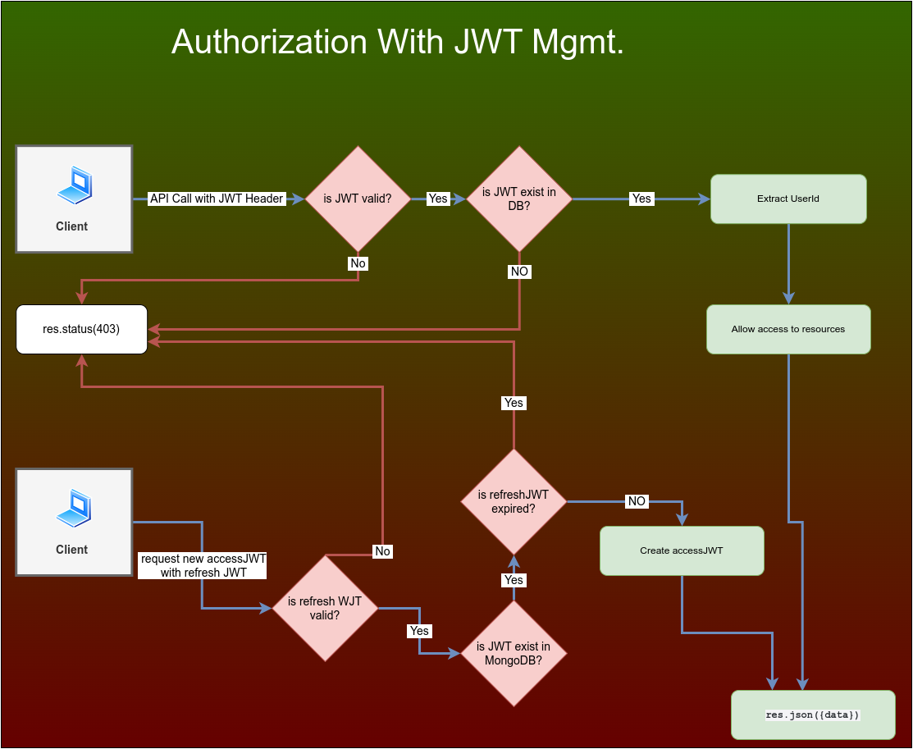
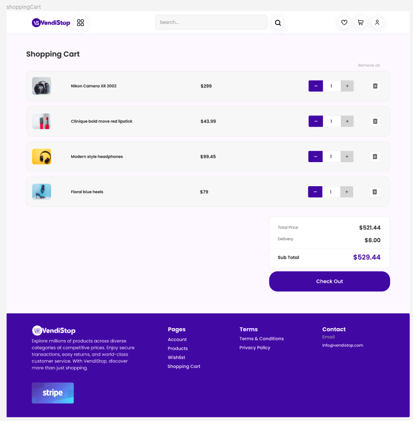

# Prateek Khindri and Nat Tucknott's T3A2-B Full Stack Application

# R10

[Front-end Deployed Website](https://vendistop.netlify.app/)

[Back-end Deployed Website](https://vendistop-api-551f58ca7ada.herokuapp.com/)

# R11

[Front-end Github Repository](https://github.com/prateekkhindri/vendistop-client)

[Back-end Github Repository](https://github.com/prateekkhindri/vendistop-api)

## **Installation Instructions**

### **How to install and run the application**

To set up the Contacts Application on your local machine, follow the steps below:

- **NOTE:** You must have Node.js (version 12 or higher) and npm (version 6 or higher) installed on the system in order to run this application. Please visit [nodejs.org](https://nodejs.org/en/download) and [npmjs](https://docs.npmjs.com/downloading-and-installing-node-js-and-npm) to download the latest versions.

1. Clone the git repository using the following command:

   ```bash
   git clone git@github.com:prateekkhindri/vendistop-client.git
   ```

2. Alternatively, you can download the application as a `.ZIP` file from the repository [link](https://github.com/prateekkhindri/vendistop-client)

   Simply click on `Code` and then `Download ZIP` to download all files in a ZIP file.

3. Navigate to the project directory:

   ```bash
   cd vendistop-client
   ```

4. Execute the command below to install all required dependencies

   ```bash
   npm install
   ```

5. Execute the command below to start the development server

   ```bash
   npm run start-dev
   ```

   **The application should now be accessible in the browser at `http://localhost:3000`**

### **Running Tests**

1. To run the tests for the Contacts Application, use the following command:

   ```bash
   npm test
   ```

   **This will start `Jest` in watch mode, and you can see the test results in your terminal**

The responsiveness of the website has been tested on the following devices:

- Desktop (1280 x 950), (1920 x 1080)
- Nest Hub and Nest Hub Max (1024 x 600), (1280 x 800)
- iPad Air and Mini (820 x 1180), (768 x 1024)
- iPhone 12 Pro, XR and SE (390 x 844), (414 x 896), (375 x 667)
- Samsung Galaxy A51/71 (412 x 914)
- Samsung Galaxy S8+ (360 x 740)
- Samsung Galaxy S20 Ultra (412 x 915)
- Surface Duo and Pro 7 (540 x 720), (912 x 1360)

<br>

# Production Test Cases & Test Credentials

You can find all the production test cases and tests completed [here](/vendistop-client/src/assets/docs/production-test-cases.pdf).

**To test as an Admin user and test the Admin features please use the following credentials:**

Email: admin@example.com

Password: Helloworld90

To test as a customer register on the website with a valid email to test all the features.

<br>

# R12

# Prateek Khindri and Nat Tucknott's T3A2-A Full Stack Application

# Vendistop E-commerce Store

## R1: Description of your website, including:

**Vendistop is a singular vendor E-commerce platform designed to bring products to the digital marketplace, enabling consumers to browse and purchase with ease. This platform focuses on providing a seamless shopping experience, from product exploration to the final purchase. It integrates an efficient payment system, while also providing a comprehensive administrative interface for the platform's offerings.**

### **Purpose**

**The main purpose of Vendistop is to provide a digital platform for a specific vendor or business to showcase and sell their products, eliminating the restrictions of geographical boundaries. It empowers the vendor to manage their product offerings and track orders, while also offering customers a user-friendly shopping experience.**

### **Functionality / features**

- **User Registration/Login**

  **Venditop facilitates easy user registration and login, allowing shoppers to create personal profiles for a customized and streamlined shopping experience.**

- **Product Browsing**

  **Users can conveniently browse through various products listed across multiple categories.**

- **Wishlist**

  **This feature enables users to save their favorite products for later consideration or purchase.**

- **Purchase**

  **The platform integrates Stripe, a robust and secure online payment processor, to facilitate smooth and safe transactions.**

- **Admin Dashboard**

  **This feature provides an administrative user with the ability to manage product listings and categories through CRUD (Create, Read, Update, and Delete) operations. It also provides an overview of all orders and their details.**

- **AWS S3 Integration**

  **All product images are securely stored in AWS S3, ensuring reliable availability and scalability.**

### **Target audience**

**Vendistop primarily targets online shoppers interested in the vendor's product offerings. Given the platform's user-friendly design, the target audience encompasses anyone interested in a straightforward online shopping experience. On the other end, Vendistop serves the administrative user responsible for product management and order tracking.**

### **Tech stack**

**The technology stack for Vendistop remains the same, utilizing a diverse set of tools and libraries to create a secure, efficient, and user-friendly platform. These technologies include:**

**Frontend:**

- **React**

  **A JavaScript library for building user interfaces.**

- **Redux Toolkit**

  **The official, opinionated, batteries-included toolset for efficient Redux development.**

- **Axios**

  **A promise-based HTTP client for making HTTP requests.**

- **React-Router-DOM**

  **A standard routing library for React.**

- **React-toastify**

  **Allows you to add notifications to your app with ease.**

- **Tailwind CSS**

  **A utility-first CSS framework for rapidly building custom user interfaces.**

**Backend:**

- **Node.js with Express**

  **A minimal and flexible Node.js web application framework, providing a robust set of features for web and mobile applications.**

- **Mongoose**

  **A MongoDB object modeling tool designed to work in an asynchronous environment.**

- **JWT (jsonwebtoken)**

  **Used to securely transmit information between parties as a JSON object.**

- **Bcryptjs**

  **A library to help hash passwords.**

- **Helmet**

  **Helps secure Express apps by setting various HTTP headers.**

- **Joi**

  **Object schema validation library.**

- **Nodemailer**

  **A module for Node.js to send emails.**

- **Cors**

  **A Node.js package for providing a Connect/Express middleware that can be used to enable CORS (Cross-origin resource sharing).**

- **Dotenv**

  **A zero-dependency module that loads environment variables from a .env file into process.env.**

- **Morgan**

  **HTTP request logger middleware for Node.js.**

- **UUID**

  **A library to create unique identifiers.**

- **Slugify**

  **A library to convert strings into URL-friendly and SEO-friendly slugs.**

**Infrastructure:**

- **AWS S3**

  **An object storage service that offers industry-leading scalability, data availability, security, and performance.**

## R2: Dataflow Diagram





## R3: Application Architecture Diagram

</br>


## R4: User Stories

</br>

**Two personas**

1. Customer/Buyer
2. Admin user

</br>

| Epic                                |                                                                                     User Story                                                                                      |
| :---------------------------------- | :---------------------------------------------------------------------------------------------------------------------------------------------------------------------------------: |
| **User Registration/Log in**        |                                            As a customer, I want to register for an account so that I can make purchases on the website.                                            |
|                                     |                                             As a customer, I want to reset my password so that I can access my account if I forget it.                                              |
|                                     |                                         As a customer, I want to change my password as I’m logged in so that I can keep my account secure.                                          |
|                                     |                                       As a customer, I want to log in to my account so I can access my personal settings, wishlist, and cart.                                       |
|                                     |                                                     As an admin, I want to register for an account so I can manage the website.                                                     |
|                                     |                                              As an admin, I want to reset my password so that I can access my account if I forget it.                                               |
|                                     |                                               As an admin, I want to log into my admin dashboard to oversee the website's operations.                                               |
|                                     |                                                As a customer, I want to view all the products so that I see what’s available for me.                                                |
| **Product and Category Management** |              As a customer, I want to view detailed information of each product, including images, price, and description, so I can make informed purchase decisions.               |
|                                     |                                   As a customer, I want to view the categories so that I can choose which category of products I want to access.                                    |
|                                     |                      As a customer, I want to select a category and view the products within that category so that I can find the product I wish to purchase.                       |
|                                     |                             As an admin, I want to view the details of each product listed on the website so I can monitor and manage the product list.                             |
|                                     |                                               As an admin, I want to create a product so that I can list a new product on my website                                                |
|                                     |                                               As an admin, I want to edit a product so that I can change the details of the product.                                                |
|                                     |                                          As an admin, I want to delete a product so that I can remove a product I no longer want to list.                                           |
|                                     |                                             As an admin, I want to create a category so that I can group my products more effectively.                                              |
|                                     |                                             As an admin, I want to edit a category so that I can change the name and keep it up to date                                             |
|                                     |                                             As an admin, I want to delete a category so that I can remove the category from my website.                                             |
| **Shopping Cart & Checkout**        |                                         As a customer, I want to add products to a shopping cart so I can purchase multiple items at once.                                          |
|                                     |                             As a customer, I want to increase the quantity of a product in my shopping cart so that I can order more of the same item.                              |
|                                     |                                        As a customer, I want to view the items in my shopping cart so I can review what I plan to purchase.                                         |
|                                     |                                            As a customer, I want to remove items from my shopping cart if I decide not to purchase them.                                            |
|                                     |                        As a customer, I want to check out my shopping cart, pay via Stripe, and provide shipping information so I can receive my purchases.                         |
|                                     |                           As a customer, I want to view the total order amount and the shipping costs so that I can understand how much my order will be.                           |
|                                     |                                              As a customer, I want to view my order history so I can keep track of my past purchases.                                               |
|                                     | As a customer, I want to view the details of my past orders (including purchased items, order ID, total cost and status) to have a comprehensive understanding of each transaction. |
|                                     |                                      As an admin, I want to view an overview of orders from my dashboard to track sales and processing status.                                      |
|                                     |                                        As an admin, I want to see a list of all orders and their statuses to ensure smooth order processing.                                        |
|                                     |                                             As an admin, I want to filter by the status of orders, so that I can view orders by status.                                             |
|                                     |                                                   As an admin, I want to click on an order so that I can view the order details.                                                    |
| **Wishlist**                        |                                                 As a customer, I want to add products to my wishlist so I can save them for later.                                                  |
|                                     |                                      As a customer, I want to view all the items in my wishlist so I can decide which ones I want to purchase.                                      |
|                                     |                                                 As a customer, I want to remove items from my wishlist if I no longer desire them.                                                  |
|                                     |                                         As a customer, I want to directly add items from my wishlist to my shopping cart for easy checkout.                                         |
| **Settings & Support**              |                                               As a customer, I want to edit my profile so that I can keep my information up to date.                                                |
|                                     |                                        As a customer, I want to change my email address so that I can receive notifications to my new email.                                        |
|                                     |                                                As an admin, I want to edit my profile so that I can keep my information up to date.                                                 |
|                                     |                                         As an admin, I want to change my email address so that I can receive notifications to my new email.                                         |
| **Legal**                           |                            As a customer, I want to easily access the terms and conditions so I can understand my legal obligations when using the site.                            |
|                                     |                              As a customer, I want to easily access the privacy policy to understand how my personal data is being used and protected.                              |
|                                     |                                              As a customer, I want to accept the terms and conditions so that I can create my account.                                              |
|                                     |                             As an admin, I want to easily access the terms and conditions so I can understand my legal obligations when using the site.                             |
|                                     |                               As an admin, I want to easily access the privacy policy to understand how my personal data is being used and protected.                               |
|                                     |                                               As an admin, I want to accept the terms and conditions so that I can create my account.                                               |

## R5: Wireframes for multiple standard screen sizes, created using industry standard software

</br>

### **Sitemap**

Link to [Sitemap](https://www.figma.com/file/dO4RcbwiBfiPrNcQfAa2UZ/T3A2-A-Vendistop-Sitemap?type=whiteboard&node-id=0%3A1&t=711Ksg3T0mbusqny-1)


</br>

### **Wireframes**

<br>

[Desktop Wireframes](https://www.figma.com/file/VKbiN9b3hHs8perEPcroXV/T3A2-A-Vendistop-Wireframe?type=design&node-id=0%3A1&mode=design&t=SpUDP8Ez4Hgx8S7Q-1)

Customer - Desktop home


Customer - Edit profile


Customer - Shopping cart


Customer - Log in


<br>

[Mobile Wireframes](https://www.figma.com/file/VKbiN9b3hHs8perEPcroXV/T3A2-A-Vendistop-Wireframe?type=design&node-id=204%3A16&mode=design&t=SpUDP8Ez4Hgx8S7Q-1)

Admin - Products


Customer - Order Details


Customer - Products


Customer - Shopping Cart


Customer - Wishlist


### **Designs**

[Desktop Prototypes](https://www.figma.com/proto/z7bTTMQmhKitQ66neCf5pn/T3A2-A-Vendistop-Design?type=design&node-id=1-5146&t=GRaAkI20lId6gzhZ-1&scaling=min-zoom&page-id=0%3A1&starting-point-node-id=1%3A5146&show-proto-sidebar=1&mode=design)

[Mobile Prototypes](https://www.figma.com/proto/z7bTTMQmhKitQ66neCf5pn/T3A2-A-Vendistop-Design?type=design&node-id=904-3287&t=geb0l6io5dXeG2Mo-1&scaling=min-zoom&page-id=904%3A29&starting-point-node-id=904%3A3287&show-proto-sidebar=1&mode=design)

<br>

- [Desktop](https://www.figma.com/file/z7bTTMQmhKitQ66neCf5pn/T3A2-A-Vendistop-Design?type=design&node-id=1%3A6109&mode=design&t=PIhWArk1Xa5RoYE9-1)

Customer - Home


Customer - Product Detail


Customer/Admin - Registration


Customer - Shopping Cart



<br>

- [Mobile](https://www.figma.com/file/z7bTTMQmhKitQ66neCf5pn/T3A2-A-Vendistop-Design?type=design&node-id=904%3A29&mode=design&t=PIhWArk1Xa5RoYE9-1)

Admin - Dashboard


Customer - Homepage


Customer - Login


Customer - Registration


Admin - Category


## R6: Screenshots of your Trello board throughout the duration of the project

**The [Trello](https://trello.com/) project management platform was used to manage the application's implementation plan and design. I was successful at planning, prioritising, and organising my activities into digestible portions.**


### **An _Agile_ based sprint board can be created as depicted below :**

- ### **Backlog**

  - **Includes the tasks that must be completed for a project**

- ### **In Development**

  - **Includes tasks that must be completed or are being worked on.**

- ### **Ready For Test**

  - **Includes tasks that are completed and are in the testing phase**

- ### **Product Walkthrough**

  - **Includes tasks for a senior team-member to review before presenting it to the client for feedback**

- ### **Ready For Release**

  - **Includes tasks/features ready for client feedback**

- ### **Done**

  - **Includes all completed tasks**

However, we did not include the _`Product Walkthrough`_ list in the board. In addition, each task was color-coded according to priority, with red representing high priority, orange representing medium priority, and yellow representing low priority. In addition, for each activity, a checklist of checklist items was provided, which aided in breaking down the tasks into smaller components. Finally, each job was assigned a serial number, which made it much easier to make frequent commits to a remote repository.

The color-coded scheme is depicted below.


## **Managing and Tracking Tasks: How We Succeeded**

- Using labels and color coding to categorise tasks

- Utilising a checklist for each item or task

- Setting up due dates to track the progress of each task

- Reviewing and updating the board regularly

- Writing and participating in stand ups with our peers and educators on Discord

A link to the [Trello](https://trello.com/) workspace can be found [here](https://trello.com/b/w4eRNmdQ/t3a2-ab-full-stack-app)

```
https://trello.com/b/w4eRNmdQ/t3a2-ab-full-stack-app
```
